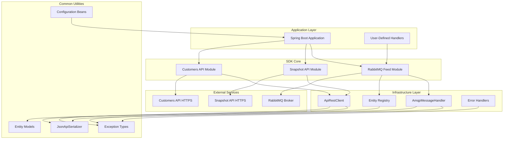
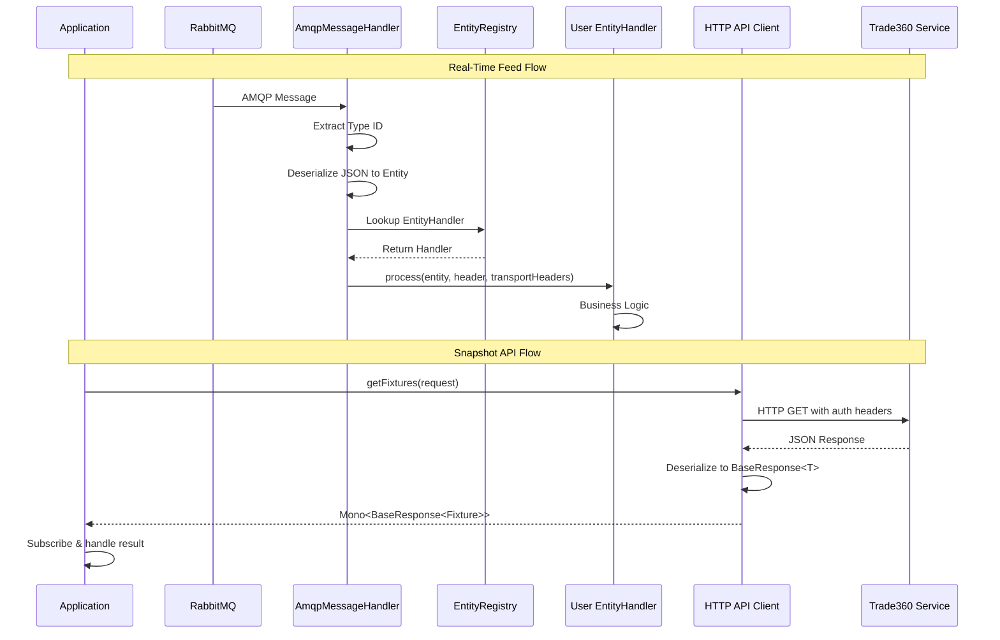
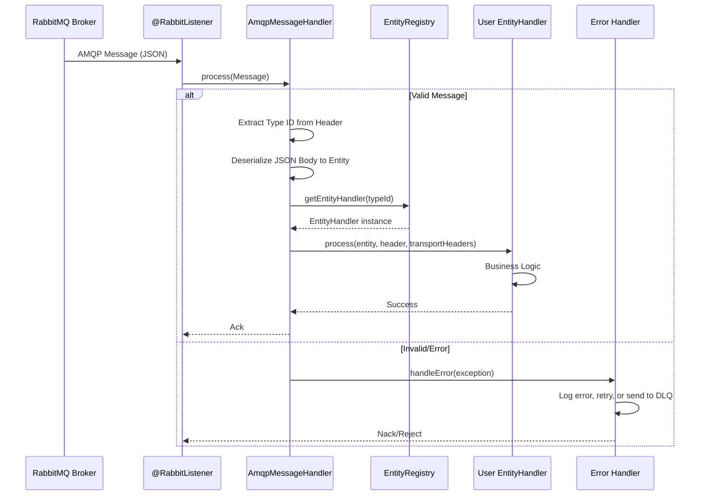
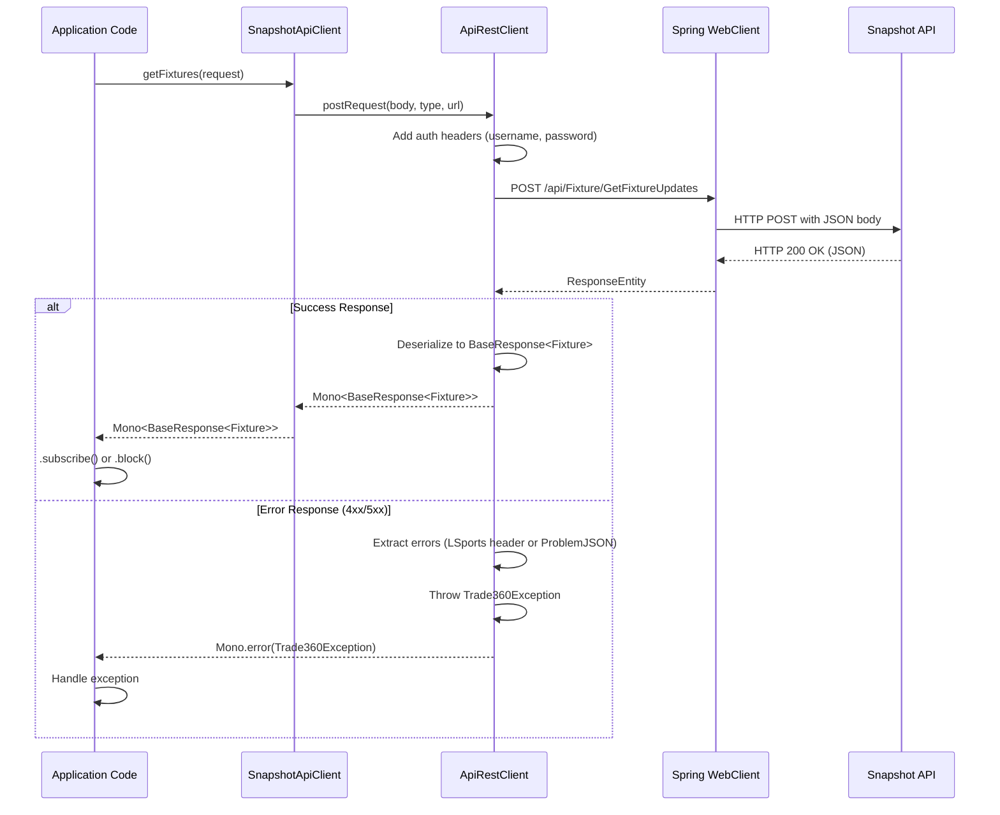

# Trade360 Java SDK

## 🧾 Project Brief

The **Trade360 Java SDK** is a comprehensive Java library designed to simplify integration with LSports Trade360 services. This SDK provides developers with a complete set of tools to connect to real-time sports data feeds, access snapshot APIs for recovery purposes, and manage customer subscriptions and metadata—all within the LSports Sports Trading Management (STM) ecosystem.

**Role in the STM Ecosystem:**  
The SDK serves as the primary integration point for Java-based applications consuming Trade360 data. It abstracts the complexities of RabbitMQ messaging, HTTP client configuration, authentication, error handling, and message deserialization, enabling developers to focus on business logic rather than infrastructure concerns.

**Primary Responsibilities:**
- Establish and maintain connections to RabbitMQ feeds for real-time sports data
- Provide typed HTTP clients for Snapshot API (recovery) and Customers API (metadata, subscriptions)
- Handle message parsing, routing, and type-safe entity mapping
- Manage authentication, retries, error recovery, and connection resilience
- Offer Spring Boot integration for seamless dependency injection and configuration

---

## ⚙️ Tech Context

**Technologies & Frameworks:**
- **Java 17** (JDK 17 required)
- **Spring Boot 3.3.2** (Spring Framework ecosystem)
- **Spring AMQP** (RabbitMQ integration)
- **Spring WebFlux** (Reactive HTTP client using `WebClient`)
- **Project Reactor** (Reactive streams for asynchronous operations)
- **Jackson** (JSON serialization/deserialization)
- **Lombok** (Code generation for boilerplate reduction)
- **Maven 3.9.8+** (Dependency management and build automation)

**Infrastructure Components:**
- **RabbitMQ** (Message broker for real-time data streaming)
- **Trade360 Snapshot API** (HTTP API for data recovery)
- **Trade360 Customers API** (HTTP API for subscriptions, metadata, and package management)

**Testing & Quality:**
- **JUnit 4.13.2** (Unit testing framework)
- **Spring Boot Test** (Integration testing utilities)
- **Mockito** (Mocking framework)
- **OkHttp MockWebServer** (HTTP client testing)
- **JaCoCo 0.8.12** (Code coverage reporting)

---

## 📘 Overview

The Trade360 Java SDK enables seamless consumption of real-time sports trading data through three primary integration patterns:

### 1. **Real-Time Feed (RabbitMQ)**
   - Connects to InPlay and PreMatch RabbitMQ queues
   - Automatically deserializes and routes messages based on type (fixture updates, livescore, markets, settlements, outright data, etc.)
   - Supports configurable retry policies, error handlers, and recovery mechanisms
   - Automatically starts/stops distribution based on application lifecycle

### 2. **Snapshot API (HTTP Recovery)**
   - Provides typed HTTP clients for retrieving historical or recovery data
   - Supports fixture snapshots, market snapshots, and livescore retrieval
   - Built on reactive paradigm using `Mono<T>` for asynchronous operations
   - Handles authentication, error extraction, and response mapping automatically

### 3. **Customers API (Subscription & Metadata)**
   - **Package Distribution:** Start, stop, and query distribution status
   - **Metadata API:** Retrieve sports, leagues, locations, markets, and translations
   - **Subscription API:** Subscribe/unsubscribe to fixtures or leagues, manage suspensions, query quotas
   - **Package Query API:** Query package-specific configuration and settings

**Data Flow:**  
1. **Input:** RabbitMQ messages arrive via AMQP or HTTP requests are made to APIs
2. **Processing:** SDK deserializes messages, validates types, extracts headers, and routes to user-defined handlers
3. **Output:** Typed Java entities (e.g., `MarketUpdate`, `LivescoreUpdate`, `Fixture`) are passed to application-specific business logic

---

## 🧱 Architecture

The SDK follows a **layered architecture** with clear separation of concerns:



### Directory Structure

```
trade360-java-sdk/
├── sdk/trade360-java-sdk/          # Core SDK library
│   └── src/main/java/eu/lsports/trade360_java_sdk/
│       ├── common/                  # Shared utilities, models, exceptions
│       │   ├── configuration/       # PackageCredentials, Trade360Settings
│       │   ├── entities/            # Data models (fixtures, markets, livescore, enums)
│       │   ├── exceptions/          # Trade360Exception
│       │   ├── http/                # HTTP client abstractions
│       │   ├── models/              # MessageHeader, TransportMessageHeaders
│       │   └── serialization/       # Jackson serializers
│       ├── customers_api/           # Customers API client implementations
│       │   ├── entities/            # Request/response DTOs
│       │   ├── interfaces/          # Client interfaces
│       │   └── springframework/     # Spring Boot factory implementations
│       ├── feed/                    # RabbitMQ feed module
│       │   └── rabbitmq/
│       │       ├── configurations/  # RabbitConnectionConfiguration, bean registrars
│       │       ├── handlers/        # AmqpMessageHandler, EntityRegistry
│       │       └── interfaces/      # MessageHandler, EntityHandler
│       └── snapshot_api/            # Snapshot API client implementations
│           ├── entities/            # Request/response DTOs
│           ├── interfaces/          # Client interfaces
│           └── springframework/     # Spring Boot factory implementations
├── samples/trade360-samples/       # Example applications
│   └── src/main/java/eu/lsports/
│       ├── trade360feedexample/     # RabbitMQ feed example with handlers
│       ├── trade360_snapshot_api_example/  # Snapshot API usage examples
│       └── trade360_customer_api_example/  # Customers API usage examples
└── docs/                            # Documentation assets
```

---

## 🎨 Design

### Design Principles

**1. Reactive & Asynchronous by Design**  
- All HTTP API clients return `Mono<T>` (Project Reactor), enabling non-blocking, asynchronous operations
- Supports high-throughput scenarios without thread blocking

**2. Factory Pattern for Client Creation**  
- `SnapshotApiClientFactory` and `CustomersApiClientFactory` abstract client instantiation
- Supports multiple implementations (e.g., `SpringBootSnapshotApiClientFactory`)
- Enables easy testing and dependency injection

**3. Handler-Based Message Routing**  
- `EntityRegistry` maps message type IDs to user-defined `EntityHandler` implementations
- Decouples message processing from infrastructure concerns
- Allows per-message-type business logic

**4. Configuration-Driven**  
- All connections, credentials, and settings externalized to `application.properties`
- Supports multiple environments (dev, QA, prod) without code changes

**5. Resilience & Error Handling**  
- Configurable retry policies (exponential backoff)
- Custom error handlers (`MessageRecoverer`, `RabbitListenerErrorHandler`)
- `Trade360Exception` provides detailed error context with multiple error messages

**6. Type Safety**  
- Strongly typed entities (e.g., `MarketUpdate`, `Fixture`, `Livescore`)
- Enum-based message types (`MessageType`, `FixtureStatus`, `BetStatus`)

### Architectural Patterns

- **Dependency Injection:** Spring Boot beans for factories, handlers, configurations
- **Template Method:** `ApiRestClient` defines HTTP operations, implementations handle specifics
- **Registry Pattern:** `EntityRegistry` for handler registration and lookup
- **Builder Pattern:** `WebClient.Builder` for HTTP client configuration

### Component Interaction Diagram



---

## 🧩 Core Components

### 1. **Feed Module** (`feed/rabbitmq/`)
   - **`AmqpMessageHandler`**: Parses incoming AMQP messages, extracts type IDs, deserializes JSON bodies, and routes to appropriate `EntityHandler`
   - **`EntityRegistry`**: Registry for user-defined entity handlers, indexed by message type ID
   - **`RabbitConnectionConfiguration`**: Configuration bean for RabbitMQ connection parameters
   - **`DynamicRabbitMQDefinitionRegistrar`**: Dynamically registers Spring AMQP listener containers based on configuration prefixes

### 2. **Snapshot API Module** (`snapshot_api/`)
   - **`SnapshotApiClientFactory`**: Factory interface for creating Snapshot API clients
   - **`InPlaySnapshotApiClient`**: Client for InPlay snapshot operations (fixtures, markets, livescores)
   - **`PreMatchSnapshotApiClient`**: Client for PreMatch snapshot operations
   - **`SpringBootSnapshotApiClientFactory`**: Spring Boot implementation using `WebClient`

### 3. **Customers API Module** (`customers_api/`)
   - **`PackageDistributionApiClient`**: Start, stop, and query distribution status
   - **`MetadataApiClient`**: Retrieve sports, leagues, locations, markets, translations
   - **`SubscriptionApiClient`**: Subscribe/unsubscribe to fixtures/leagues, manage suspensions, query quotas
   - **`PackageQueryApiClient`**: Query package configuration
   - **`SpringBootCustomersApiClientFactory`**: Spring Boot implementation using `WebClient`

### 4. **Common Utilities** (`common/`)
   - **`PackageCredentials`**: Holds package ID, username, and password
   - **`Trade360Settings`**: Base URL and credentials configuration
   - **`Trade360Exception`**: Custom exception with detailed error messages
   - **`JsonApiSerializer`**: Jackson-based JSON serialization/deserialization
   - **`ApiRestClient`**: HTTP client abstraction for GET/POST requests
   - **`SpringBootApiRestClient`**: WebFlux-based implementation with error extraction

### 5. **Entity Models** (`common/entities/`)
   - **`enums/`**: `MessageType`, `FixtureStatus`, `BetStatus`, `StatisticType`, `MarketType`, etc.
   - **`fixtures/`**: `Fixture`, `League`, `Sport`, `Participant`, `Location`, etc.
   - **`markets/`**: `Market`, `Bet`, `Provider`, `ProviderMarket`, etc.
   - **`livescore/`**: `Livescore`, `Scoreboard`, `Period`, `Clock`, `Statistic`, etc.
   - **`message_types/`**: `MarketUpdate`, `LivescoreUpdate`, `FixtureMetadataUpdate`, `SettlementUpdate`, etc.

---

## 🚀 Key Features

1. **Automatic Message Routing**: Messages are automatically deserialized and routed to type-specific handlers based on message type ID
2. **Connection Resilience**: Built-in retry mechanisms, exponential backoff, and network recovery for RabbitMQ connections
3. **Reactive HTTP Clients**: All API clients use reactive `Mono<T>` for non-blocking, high-performance operations
4. **Spring Boot Integration**: First-class support for Spring Boot with auto-configuration and dependency injection
5. **Comprehensive Entity Models**: Strongly typed Java classes for all Trade360 data structures
6. **Error Handling**: Detailed exception types with multiple error messages for debugging
7. **Automatic Authentication**: SDK handles authentication headers for all HTTP requests
8. **Multi-Environment Support**: Externalized configuration for dev, QA, and production environments
9. **Manual & Auto ACK**: Configurable message acknowledgment strategies for RabbitMQ
10. **Distribution Lifecycle Management**: Automatic start/stop distribution based on application lifecycle

---

## 🔄 Request / Processing Flow

### RabbitMQ Feed Message Flow



### Snapshot API HTTP Flow



---

## 🧩 Dependencies

### Core Dependencies

| Dependency | Version | Purpose |
|------------|---------|---------|
| `spring-boot-starter-amqp` | 3.3.2 | RabbitMQ integration |
| `spring-boot-starter-webflux` | 3.3.2 | Reactive HTTP client (WebClient) |
| `spring-boot-starter-validation` | 3.3.2 | Bean validation |
| `jackson-databind` | 2.15.x | JSON serialization/deserialization |
| `jackson-datatype-jsr310` | 2.15.x | Java 8 time support in Jackson |
| `lombok` | 1.18.x | Boilerplate code reduction |
| `jetbrains-annotations` | 17.0.0 | Nullability annotations |

### Test Dependencies

| Dependency | Version | Purpose |
|------------|---------|---------|
| `spring-boot-starter-test` | 3.3.2 | Testing utilities |
| `spring-rabbit-test` | 3.1.x | RabbitMQ testing |
| `junit` | 4.13.2 | Unit testing framework |
| `okhttp3` | 5.0.0-alpha.14 | HTTP client for testing |
| `mockwebserver` | 5.0.0-alpha.14 | Mock HTTP server |

### Build Plugins

| Plugin | Version | Purpose |
|--------|---------|---------|
| `jacoco-maven-plugin` | 0.8.12 | Code coverage reporting |
| `maven-source-plugin` | 3.3.0 | Source JAR generation |
| `maven-javadoc-plugin` | 3.6.3 | Javadoc generation |
| `maven-gpg-plugin` | 3.1.0 | Artifact signing for Maven Central |

---

## 🧰 Getting Started

### 🔑 Prerequisites

Ensure you have the following installed:

- **JDK 17** (required):
  - [Adoptium Temurin 17](https://adoptium.net/temurin/releases/?version=17)
  - [OpenJDK 17](https://jdk.java.net/java-se-ri/17-MR1)
- **Maven 3.9.8+**: [Download Maven](https://maven.apache.org/download.cgi)
- **LSports Trade360 Credentials**:
  - Package ID
  - Username
  - Password
  - RabbitMQ connection details (host, port, virtual host)
  - Snapshot API base URL (e.g., `https://stm-snapshot.lsports.eu`)
  - Customers API base URL (e.g., `https://stm-api.lsports.eu`)

### ⚙️ Installation & Running

#### 1. Clone the Repository

```bash
git clone https://github.com/lsportsltd/trade360-java-sdk.git
cd trade360-java-sdk
```

#### 2. Build the SDK

```bash
mvn clean install
```

This will:
- Compile the SDK library
- Run unit tests
- Generate code coverage reports
- Install the SDK to your local Maven repository

#### 3. Configure Your Application

Navigate to the samples directory and update `application.properties`:

```bash
cd samples/trade360-samples/src/main/resources
```

Edit `application.properties`:

```properties
# Application Settings
spring.application.name=trade360-samples
spring.codec.max-in-memory-size=10MB

# InPlay RabbitMQ Configuration
rabbitmq.inplay.name=inplay
rabbitmq.inplay.rabbit_listener_container_factory_name=inPlaySimpleRabbitListenerContainerFactory
rabbitmq.inplay.package_id=YOUR_PACKAGE_ID
rabbitmq.inplay.host=trade360-inplay-rabbitmq-host
rabbitmq.inplay.port=5672
rabbitmq.inplay.virtual_host=/
rabbitmq.inplay.user_name=YOUR_USERNAME
rabbitmq.inplay.password=YOUR_PASSWORD
rabbitmq.inplay.prefetch_count=100
rabbitmq.inplay.auto_ack=true
rabbitmq.inplay.requested_heartbeat_seconds=30
rabbitmq.inplay.network_recovery_interval=30
rabbitmq.inplay.retry_attempts=3
rabbitmq.inplay.retry_initial_interval=1000
rabbitmq.inplay.retry_multiple=2
rabbitmq.inplay.retry_max_interval=5000
rabbitmq.inplay.concurrent_consumers=1
rabbitmq.inplay.max_concurrent_consumers=1

# PreMatch RabbitMQ Configuration (same structure as InPlay)
rabbitmq.prematch.name=prematch
rabbitmq.prematch.rabbit_listener_container_factory_name=preMatchSimpleRabbitListenerContainerFactory
# ... (add remaining PreMatch properties)

# Snapshot API Configuration
snapshotapi.base_snapshot_api=https://stm-snapshot.lsports.eu
snapshotapi.inplay.package_id=YOUR_PACKAGE_ID
snapshotapi.inplay.user_name=YOUR_USERNAME
snapshotapi.inplay.password=YOUR_PASSWORD
snapshotapi.prematch.package_id=YOUR_PACKAGE_ID
snapshotapi.prematch.user_name=YOUR_USERNAME
snapshotapi.prematch.password=YOUR_PASSWORD

# Customers API Configuration
customersapi.base_customers_api=https://stm-api.lsports.eu
customersapi.inplay.package_id=YOUR_PACKAGE_ID
customersapi.inplay.user_name=YOUR_USERNAME
customersapi.inplay.password=YOUR_PASSWORD
customersapi.prematch.package_id=YOUR_PACKAGE_ID
customersapi.prematch.user_name=YOUR_USERNAME
customersapi.prematch.password=YOUR_PASSWORD
```

#### 4. Run the Sample Application

```bash
cd ../../../../  # Navigate back to samples/trade360-samples
mvn spring-boot:run
```

The application will:
- Connect to RabbitMQ feeds
- Start distribution automatically
- Begin receiving and processing messages
- Log all activities to console

#### 5. Implement Your Own Handlers

Create custom handlers by implementing the `EntityHandler` interface:

```java
import eu.lsports.trade360_java_sdk.feed.rabbitmq.interfaces.EntityHandler;
import eu.lsports.trade360_java_sdk.common.entities.message_types.MarketUpdate;

public class MyMarketUpdateHandler implements EntityHandler<MarketUpdate> {
    @Override
    public void process(MarketUpdate entity, Map<String, String> header, Map<String, String> transportHeaders) {
        // Your business logic here
        System.out.println("Received MarketUpdate with " + entity.events.size() + " events");
    }
}
```

Register your handler in the configuration:

```java
@Bean
public EntityRegistry inPlayEntityRegister() {
    EntityRegistry entityRegistry = new EntityRegistry();
    entityRegistry.setEntityHandler(new MyMarketUpdateHandler());
    // ... register other handlers
    return entityRegistry;
}
```

---

## 🚢 Deployment

### Maven Dependency (When Published to Maven Central)

Add the SDK as a dependency in your `pom.xml`:

```xml
<dependency>
    <groupId>eu.lsports</groupId>
    <artifactId>trade360-java-sdk</artifactId>
    <version>2.6.2</version>
</dependency>
```

### Environment-Specific Configuration

Use Spring profiles to manage different environments:

**`application-dev.properties`:**
```properties
rabbitmq.inplay.host=dev-rabbitmq.lsports.eu
snapshotapi.base_snapshot_api=https://dev-stm-snapshot.lsports.eu
```

**`application-prod.properties`:**
```properties
rabbitmq.inplay.host=prod-rabbitmq.lsports.eu
snapshotapi.base_snapshot_api=https://stm-snapshot.lsports.eu
```

Run with profile:
```bash
mvn spring-boot:run -Dspring-boot.run.profiles=prod
```

### Docker Deployment

**Dockerfile Example:**

```dockerfile
FROM eclipse-temurin:17-jdk-alpine
WORKDIR /app
COPY target/trade360-samples-2.2.0.jar app.jar
EXPOSE 8080
ENTRYPOINT ["java", "-jar", "app.jar"]
```

**Build & Run:**

```bash
docker build -t trade360-app .
docker run -p 8080:8080 \
  -e RABBITMQ_INPLAY_HOST=prod-rabbitmq.lsports.eu \
  -e RABBITMQ_INPLAY_USER_NAME=prod-user \
  -e RABBITMQ_INPLAY_PASSWORD=secret \
  trade360-app
```

### CI/CD Considerations

- **Secrets Management**: Use environment variables or secret management tools (AWS Secrets Manager, Azure Key Vault, HashiCorp Vault) for credentials
- **Health Checks**: Implement Spring Boot Actuator endpoints (`/actuator/health`) for container orchestration
- **Logging**: Configure structured logging (JSON format) for centralized log aggregation
- **Versioning**: Use semantic versioning and tag releases in Git
- **Rollback**: Maintain previous Docker images or JARs for quick rollback

---

## 🧪 Testing

### Running Tests

```bash
# Run all tests
mvn test

# Run tests with coverage report
mvn clean test jacoco:report

# View coverage report
open sdk/trade360-java-sdk/target/site/jacoco/index.html
```

### Test Organization

- **Unit Tests**: Located in `src/test/java/eu/lsports/trade360_java_sdk/`
  - `common/`: Configuration, serialization, HTTP client tests
  - `customers_api/`: Customers API client tests
  - `snapshot_api/`: Snapshot API client tests
  - `feed/`: RabbitMQ handler tests

### Test Coverage

Current coverage target: **80%+** (branch and line coverage)

### Example Test

```java
@Test
public void testMarketUpdateDeserialization() throws Exception {
    String json = "{\"events\":[{\"id\":123}]}";
    MarketUpdate update = objectMapper.readValue(json, MarketUpdate.class);
    assertNotNull(update.events);
}
```

---

## 🐞 Debugging

### Enable Verbose Logging

Add to `application.properties`:

```properties
logging.level.eu.lsports.trade360_java_sdk=DEBUG
logging.level.org.springframework.amqp=DEBUG
logging.level.reactor.netty=DEBUG
```

### Common Issues

**1. RabbitMQ Connection Refused**
- **Symptom**: `java.net.ConnectException: Connection refused`
- **Solution**: Verify RabbitMQ host, port, and virtual host in `application.properties`

**2. Authentication Failure**
- **Symptom**: `401 Unauthorized` or `403 Forbidden`
- **Solution**: Verify package ID, username, and password

**3. Message Deserialization Errors**
- **Symptom**: `JsonMappingException` or `UnrecognizedPropertyException`
- **Solution**: Enable logging to inspect raw JSON, verify entity models match API schema

**4. No Messages Received**
- **Symptom**: Application starts but no messages are processed
- **Solution**: 
  - Check distribution status: `/api/PackageDistribution/GetDistributionStatus`
  - Verify queue exists in RabbitMQ management console
  - Confirm `auto_ack` and `prefetch_count` settings

### Debugging Tools

- **RabbitMQ Management Console**: `http://<rabbitmq-host>:15672`
- **Spring Boot Actuator**: Add `spring-boot-starter-actuator` and access `/actuator/health`, `/actuator/metrics`
- **IDE Debugger**: Set breakpoints in `AmqpMessageHandler.process()` or your entity handlers
- **Network Inspection**: Use `tcpdump` or Wireshark to inspect AMQP traffic

---

## 📊 Monitoring & Observability

### Logging

The SDK uses **Log4j2** for logging. Key log statements include:

- RabbitMQ connection lifecycle events
- Message processing start/end
- Deserialization errors
- HTTP request/response summaries

### Health Checks

Add Spring Boot Actuator:

```xml
<dependency>
    <groupId>org.springframework.boot</groupId>
    <artifactId>spring-boot-starter-actuator</artifactId>
</dependency>
```

Access health endpoint:
```bash
curl http://localhost:8080/actuator/health
```

### Metrics

Expose metrics via Actuator:

```properties
management.endpoints.web.exposure.include=health,metrics,prometheus
```

Monitor key metrics:
- **RabbitMQ**: Message consumption rate, error rate, queue depth
- **HTTP Clients**: Request latency, error rate, timeout rate
- **JVM**: Heap usage, garbage collection, thread count

### Distributed Tracing

Integrate with **Spring Cloud Sleuth** and **Zipkin** for distributed tracing:

```xml
<dependency>
    <groupId>org.springframework.cloud</groupId>
    <artifactId>spring-cloud-starter-sleuth</artifactId>
</dependency>
```

---

## 🧭 Configuration

### Environment Variables

Override `application.properties` with environment variables:

| Property | Environment Variable |
|----------|----------------------|
| `rabbitmq.inplay.host` | `RABBITMQ_INPLAY_HOST` |
| `rabbitmq.inplay.user_name` | `RABBITMQ_INPLAY_USER_NAME` |
| `rabbitmq.inplay.password` | `RABBITMQ_INPLAY_PASSWORD` |
| `snapshotapi.base_snapshot_api` | `SNAPSHOTAPI_BASE_SNAPSHOT_API` |

### Configuration Reference

#### RabbitMQ Configuration

| Property | Type | Default | Description |
|----------|------|---------|-------------|
| `name` | String | - | Connection name for logging |
| `package_id` | Integer | **Required** | LSports package ID (used for queue name) |
| `host` | String | `localhost` | RabbitMQ host |
| `port` | Integer | `5672` | RabbitMQ port |
| `virtual_host` | String | `/` | RabbitMQ virtual host |
| `user_name` | String | `guest` | RabbitMQ username |
| `password` | String | `guest` | RabbitMQ password |
| `prefetch_count` | Integer | **Required** | Number of messages to prefetch |
| `auto_ack` | Boolean | `true` | Enable auto-acknowledgment |
| `requested_heartbeat_seconds` | Integer | `30` | Heartbeat interval (seconds) |
| `network_recovery_interval` | Long | `3000` | Network recovery interval (ms) |
| `retry_attempts` | Integer | `3` | Number of retry attempts |
| `retry_initial_interval` | Integer | `1000` | Initial retry interval (ms) |
| `retry_multiple` | Double | `2.0` | Retry interval multiplier |
| `retry_max_interval` | Integer | `5000` | Maximum retry interval (ms) |
| `concurrent_consumers` | Integer | `1` | Number of concurrent consumers |
| `max_concurrent_consumers` | Integer | `1` | Maximum concurrent consumers |

#### API Configuration

| Property | Type | Default | Description |
|----------|------|---------|-------------|
| `base_snapshot_api` | String | **Required** | Snapshot API base URL |
| `base_customers_api` | String | **Required** | Customers API base URL |
| `package_id` | Integer | **Required** | LSports package ID |
| `user_name` | String | **Required** | API username |
| `password` | String | **Required** | API password |

---

## 🤝 Contributing

We welcome contributions to the Trade360 Java SDK! Please follow these guidelines:

### Contribution Process

1. **Fork the Repository**: Create a fork on GitHub
2. **Create a Feature Branch**: `git checkout -b feature/my-new-feature`
3. **Make Changes**: Implement your feature or fix
4. **Write Tests**: Add unit tests for new functionality (maintain 80%+ coverage)
5. **Run Tests**: `mvn test` (ensure all tests pass)
6. **Commit Changes**: `git commit -m "Add new feature"`
7. **Push to Branch**: `git push origin feature/my-new-feature`
8. **Submit Pull Request**: Open a PR with a clear description

### Code Standards

- **Java Code Style**: Follow [Google Java Style Guide](https://google.github.io/styleguide/javaguide.html)
- **Javadoc**: Document all public classes, methods, and interfaces
- **Test Coverage**: Maintain minimum 80% line and branch coverage
- **Commit Messages**: Use clear, descriptive commit messages
- **No Breaking Changes**: Avoid breaking existing APIs unless necessary

### Testing Requirements

- All new code must include unit tests
- Integration tests for RabbitMQ and HTTP clients
- Ensure all existing tests pass before submitting PR

### Documentation

- Update README.md if adding new features
- Add inline code comments for complex logic
- Update Javadoc for public APIs

For questions or discussions, please open an issue on GitHub.

---

## 📄 License

This project is licensed under the **MIT License** - see the [LICENSE](LICENSE) file for details.

---

## 🔗 Links

### Official Documentation
- [Trade360 Snapshot API Documentation](https://docs.lsports.eu/lsports/v/integration/apis/snapshot)
- [Trade360 Customers API Documentation](https://docs.lsports.eu/lsports/v/integration/apis/customers)
- [LSports Integration Hub](https://docs.lsports.eu/lsports/v/integration)

### Spring AMQP Resources
- [Spring AMQP Documentation](https://spring.io/projects/spring-amqp)
- [Resilience & Error Recovery](https://docs.spring.io/spring-amqp/reference/amqp/resilience-recovering-from-errors-and-broker-failures.html)
- [Listener Concurrency](https://docs.spring.io/spring-amqp/reference/amqp/listener-concurrency.html)

### Project Resources
- [GitHub Repository](https://github.com/lsportsltd/trade360-java-sdk)
- [Latest Release](https://github.com/lsportsltd/trade360-java-sdk/releases/latest)
- [Issue Tracker](https://github.com/lsportsltd/trade360-java-sdk/issues)

### Related Projects
- [Trade360 .NET SDK](https://github.com/lsportsltd/trade360-dotnet-sdk)

---

## 📞 Support

For support, please contact:
- **Email**: dev@lsports.eu
- **Website**: [https://www.lsports.eu](https://www.lsports.eu)
- **GitHub Issues**: [Report an issue](https://github.com/lsportsltd/trade360-java-sdk/issues)

---

**Version**: 2.6.2  
**Last Updated**: December 2025  
**Maintained by**: LSports Development Team
